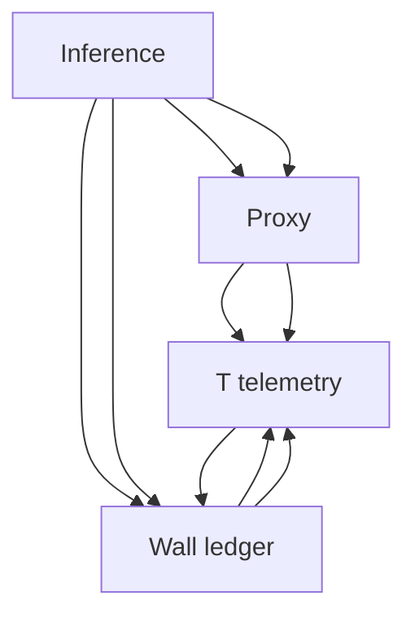

```mermaid
flowchart TD
  A[Inference] --> B[Proxy] --> C[PC-1] 
  A[Inference] --> B[Proxy] --> C[PC-2] 
  A[Inference] --> D[Governance] --> C[PC-1] 
  A[Inference] --> D[Governance] --> C[PC-2] 

  C[T telemetry] --> D[Wall ledger]
```